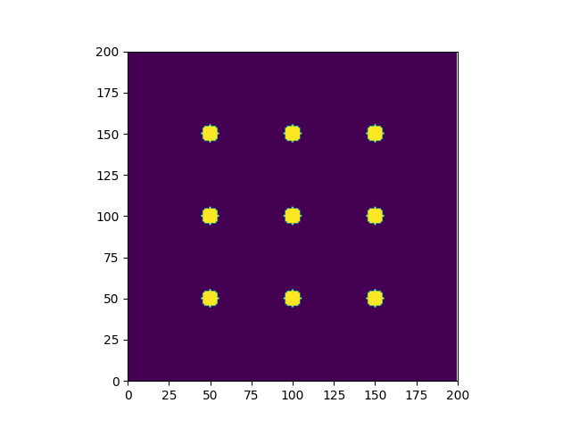
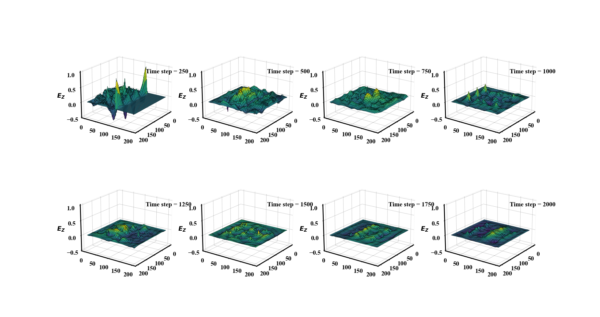
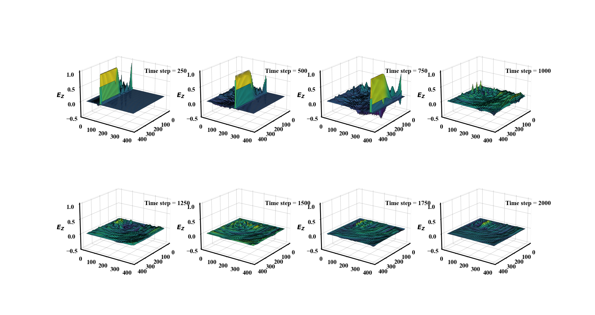
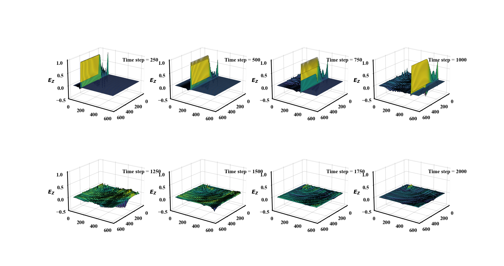
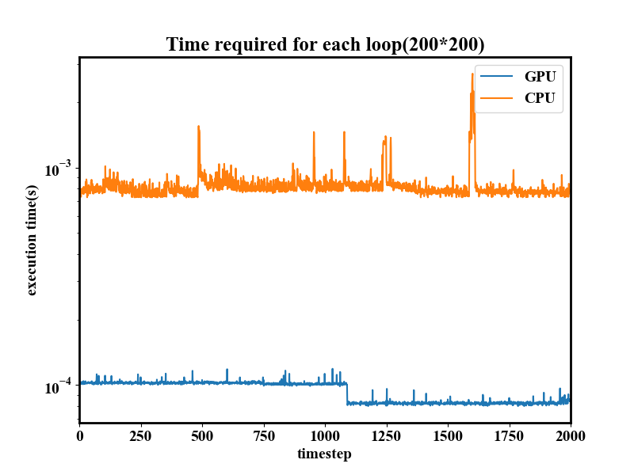
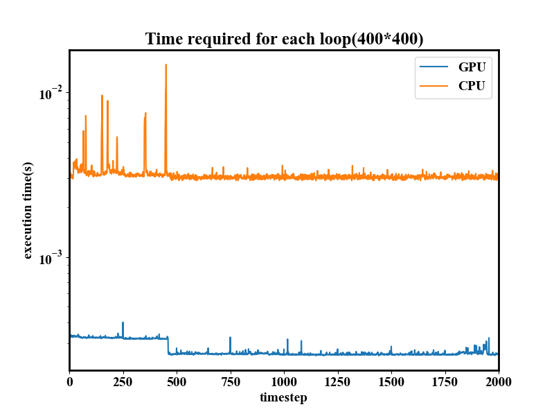
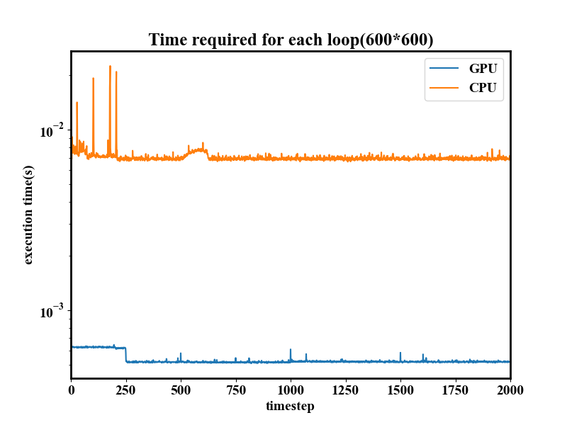

# 2D_FDTD_CUDA
A plane wave hits 9 cylinders.\

# result

# Performance comparison of CPU and GPU

# reference
[1]Houle, Jennifer E., and Dennis M. Sullivan. Electromagnetic Simulation Using the FDTD Method with Python. John Wiley & Sons, 2020.
